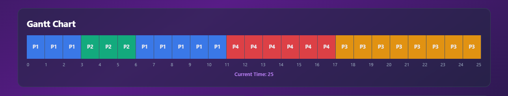
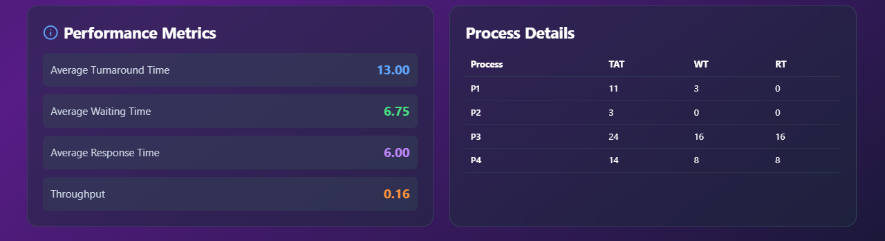

# OS Scheduling Algorithm Visualizer

A beautiful, interactive CPU scheduling algorithm simulator built with React and Tailwind CSS.


## 🚀 Features

- **5 Scheduling Algorithms**: FCFS, SJF, SRTF, Priority, Round Robin
- **Interactive Gantt Chart**: Real-time animated visualization
- **Performance Metrics**: TAT, WT, RT, and Throughput calculations
- **Dynamic Process Management**: Add/remove processes on the fly
- **Customizable Parameters**: Adjust arrival time, burst time, priority, and time quantum
- **Beautiful UI/UX**: Modern gradient design with smooth animations

## 📋 Algorithms Implemented

1. **FCFS** (First Come First Serve)
2. **SJF** (Shortest Job First)
3. **SRTF** (Shortest Remaining Time First)
4. **Priority Scheduling** (Non-preemptive)
5. **Round Robin** (with configurable time quantum)

## 🛠️ Technologies Used

- React.js
- Tailwind CSS
- Lucide React Icons
- JavaScript (ES6+)

## 📦 Installation

### Prerequisites
- Node.js (v14 or higher)
- npm or yarn

### Steps

1. Clone the repository:
```bash
git clone https://github.com/YOUR_USERNAME/os-scheduler-visualizer.git
cd os-scheduler-visualizer
```

2. Install dependencies:
```bash
npm install
```

3. Install Tailwind CSS (if not using CDN):
```bash
npm install -D tailwindcss postcss autoprefixer
npx tailwindcss init
```

4. Start the development server:
```bash
npm start
```

5. Open [http://localhost:3000](http://localhost:3000) in your browser.

## 🎮 Usage

1. **Select Algorithm**: Choose from FCFS, SJF, SRTF, Priority, or Round Robin
2. **Configure Processes**: Set arrival time, burst time, and priority for each process
3. **Add/Remove Processes**: Use the Add Process button or delete icon
4. **Adjust Speed**: Control animation speed with the slider
5. **Run Simulation**: Click Run to visualize the scheduling
6. **View Metrics**: Check performance metrics and process details

## 📊 Metrics Calculated

- **Average Turnaround Time (TAT)**: Time from arrival to completion
- **Average Waiting Time (WT)**: Time spent waiting in ready queue
- **Average Response Time (RT)**: Time from arrival to first execution
- **Throughput**: Number of processes completed per unit time

## 🖼️ Screenshots

### Gantt Chart Visualization


### Performance Metrics


## 🎯 DSA Concepts Used

- **Queue Data Structure**: Round Robin implementation
- **Sorting Algorithms**: SJF, SRTF, Priority scheduling
- **Greedy Algorithms**: Process selection logic
- **Time Complexity Optimization**: Efficient scheduling calculations

## 🤝 Contributing

Contributions are welcome! Please feel free to submit a Pull Request.

1. Fork the project
2. Create your feature branch (`git checkout -b feature/AmazingFeature`)
3. Commit your changes (`git commit -m 'Add some AmazingFeature'`)
4. Push to the branch (`git push origin feature/AmazingFeature`)
5. Open a Pull Request

## 📝 License

This project is licensed under the MIT License - see the [LICENSE](LICENSE) file for details.

## 👨‍💻 Author

Your Name
- GitHub: [@YOUR_USERNAME](https://github.com/YOUR_USERNAME)
- LinkedIn: [Your Profile](https://linkedin.com/in/yourprofile)

## 🙏 Acknowledgments

- React.js documentation
- Tailwind CSS
- Operating System scheduling algorithms concepts

## 📧 Contact

For any queries, reach out at: your.email@example.com

---

⭐ Star this repo if you found it helpful!
